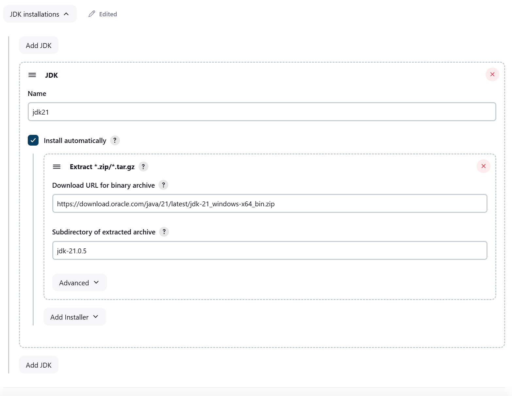
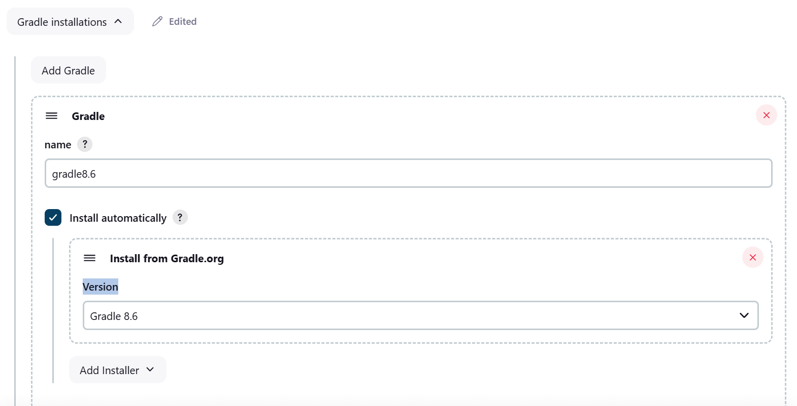
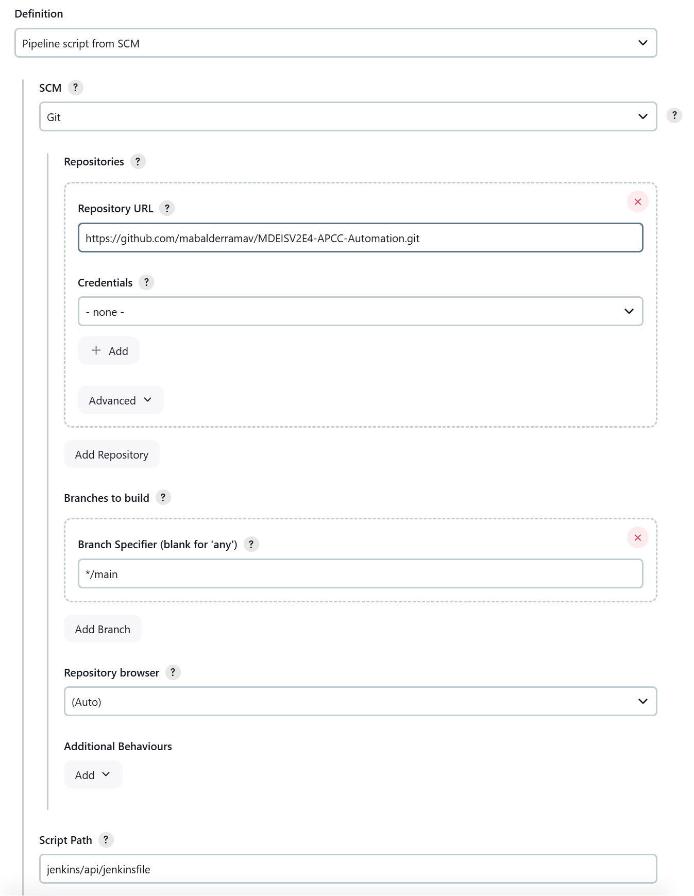
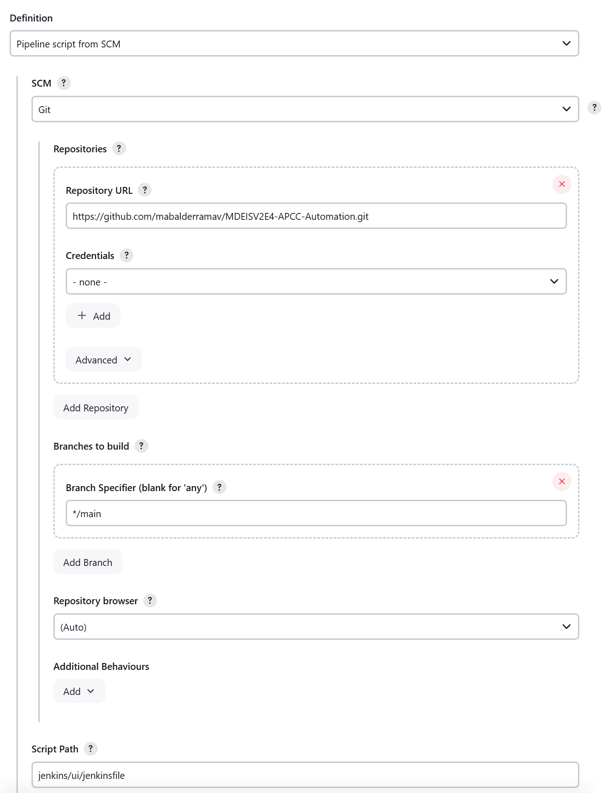

# MDEISV2E4-APCC-Automation
Automation Framework for Frontend and Backend to SYS application

## Gradle Commands to execute locally
- **Run API tests**:
    ```bash
    gradle.bat executeMedeisv2e4ApccApiFeature -DenvironmentName=QA-LOCAL -DcucumberTags="@regression"
    ```
- **Run UI tests**:
    ```bash
    gradle.bat executeMedeisv2e4ApccWebFeature -DenvironmentName=QA-LOCAL -Dbrowser=CHROME -DheadlessMode=false -DcucumberTags="@regression"
    ```

## Tools

- Java 21
- Gradle 8.6
- Selenium 4
- Jenkins (CI/CD)

## Requirements

- [Java21](https://www.oracle.com/java/technologies/downloads/#java21) (versión 21)
- [Gradle8.6](https://gradle.org/releases/) (versión 8.6)

## Instalación
1. Clone repository
```bash
   git clone https://github.com/mabalderramav/MDEISV2E4-APCC-Automation.git
```
## Deploy with Jenkins (WINDOWS)
**Requirement**:
#### To configure automated deployment with Jenkins, follow the steps below:
- **Install Jenkins with plugins**: Make sure Jenkins is installed.
- **Setup tools in jenkins**:
    ```markdown
    Dashboard > Manage Jenkins > Tools 
    ```
- **JDK installations**:
  go to JDK installations and add a new JDK installation:
  - **Name**: jdk21
  - **Install automatically**: (check)
  - **Extract *.zip/*.tar.gz**
  - **Download URL for binary archive**: https://download.oracle.com/java/21/latest/jdk-21_windows-x64_bin.zip
  - **Subdirectory of extracted archive**: jdk-21.0.5
  

- **Gradle installations**:
  go to JDK installations and add a new JDK installation:
  - **Name**: gradle8.6
  - **Install automatically**: (check)
  - *Install from Gradle.org**
  - **Version**: Gradle 8.6
  


- **Setup API pipeline**:
    - New Item
        - Name: **sys-api-auto-test**
        - Type: Pipeline
    - Pipeline
        - Definition: Pipeline script from SCM
            - SCM: Git
                - Repository URL: https://github.com/mabalderramav/MDEISV2E4-APCC-Automation.git
                - Branch Specifier: */main
            - Script Path: jenkins/api/jenkinsfile
    - (Save)
    - Build Now
    

- **Setup UI pipeline**:
    - New Item
        - Name: **sys-ui-auto-test**
        - Type: Pipeline
    - Pipeline
        - Definition: Pipeline script from SCM
            - SCM: Git
                - Repository URL: https://github.com/mabalderramav/MDEISV2E4-APCC-Automation.git
                - Branch Specifier: */main
            - Script Path: jenkins/ui/jenkinsfile
    - (Save)
    - Build Now
      
  

## License
This project is licensed under the MIT License. See the LICENSE file for details.
